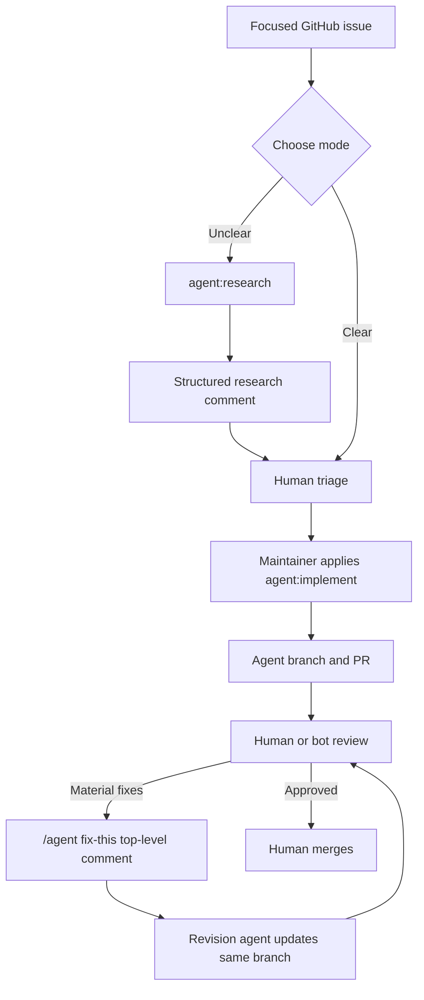

# GitHub Agent Factory

A reusable GitHub Actions template for a human-governed coding-agent queue:



Agents never merge, change repository settings, access production secrets, or decide unresolved business/security questions. All feature flags default to disabled.

## What is included

- Research, implementation, and PR-revision workflows under `.github/workflows/`.
- A focused issue form and generic agent prompts.
- Bounded GitHub-context builders that treat issues, reviews, and PR text as untrusted input.
- Optional GitHub Project V2 status sync, configured entirely through repository variables.
- Idempotent onboarding scripts for labels, variables, Project discovery, and validation.
- An explicitly non-functional evaluator example in `examples/optional/`; do not enable it as a production workflow.

## Quick start

1. Create a new repository from this template, or copy its contents into a dedicated automation branch of an existing repository.
2. Install the [Claude GitHub App](https://github.com/apps/claude) for the repository.
3. Create `CLAUDE_CODE_OAUTH_TOKEN` with `claude setup-token` and store it as an **Actions secret**.
4. Run the safe onboarding checks, then create labels and disabled variables:

   ```sh
   scripts/onboarding/check-prerequisites.sh --repo OWNER/REPO
   scripts/onboarding/bootstrap-labels.sh --repo OWNER/REPO --apply
   scripts/onboarding/configure-repo-variables.sh --repo OWNER/REPO --apply
   scripts/onboarding/verify-installation.sh --repo OWNER/REPO
   ```

5. Review the checklist below, set models, and enable one capability at a time. Start with research in a disposable repository.

Detailed instructions: [`docs/operations/onboarding.md`](docs/operations/onboarding.md).

## Required access and configuration

### GitHub repository and organization settings

- The person applying labels needs repository **write**, **maintain**, or **admin** access. Workflows enforce this for implementation and revision triggers.
- Actions must be permitted to create branches and pull requests. In organization policy, allow the actions used by the workflows; pin revisions before a production rollout if your organization requires immutable action SHAs.
- Configure a protected base branch: require pull requests, at least one human approval, and required CI checks. Do not grant agents merge authority.
- The Claude GitHub App must be installed. `id-token: write` is intentionally included in Claude jobs because the action needs it during setup.
- If organization SSO is enforced, authorize any fine-grained token used for Projects against that organization.

### Actions secrets

| Secret | Needed by | Notes |
|---|---|---|
| `CLAUDE_CODE_OAUTH_TOKEN` | Research, implementation, PR revision | Generate with `claude setup-token`; do not expose it to agent prompts. |
| `GH_PROJECT_TOKEN` | Optional Project status sync | A least-privilege fine-grained token that can read the repository and write the selected Project V2. Leave unset when sync is disabled. |

### Repository variables

| Variable | Safe default | Purpose |
|---|---:|---|
| `AGENT_RESEARCH_ENABLED` | `false` | Enables label-triggered research. Manual dispatch remains available. |
| `AGENT_IMPLEMENT_ENABLED` | `false` | Enables implementation and PR revision. |
| `AGENT_EVAL_ENABLED` | `false` | Reserved; evaluator stub is not operational. |
| `AGENT_PROJECT_SYNC_ENABLED` | `false` | Enables Project V2 status sync. |
| `AGENT_BASE_BRANCH` | `main` | Base branch used by the implementation workflow. |
| `AGENT_RESEARCH_MODEL` | unset | Claude model for research. |
| `AGENT_IMPLEMENT_MODEL` | unset | Claude model for implementation. |
| `AGENT_PR_REVISE_MODEL` | unset | Claude model for revisions. |
| `AGENT_PR_REVISE_TRUSTED_BOT_ACTORS` | unset | Comma-separated reviewer bot allowlist; humans still require write/maintain/admin. |
| `AGENT_PROJECT_ID` and `AGENT_PROJECT_STATUS_FIELD_ID` | unset | Generated IDs for optional Project sync. |
| `AGENT_PROJECT_STATUS_*` | unset | Generated option IDs for the configured Status field. |

## Operating model

- Apply `agent:research` to an unclear issue; it posts or updates one marked research comment.
- A human chooses whether to proceed, clarifies blockers, then applies `agent:implement` to a bounded issue.
- The implementation agent commits on `agent/issue-<number>-...`; the wrapper verifies it is ahead of the base branch and opens or updates a PR.
- For material, agent-fixable review findings, a trusted reviewer writes exactly one **top-level** comment starting with `/agent fix-this`. The revision workflow only accepts open same-repository `agent/issue-*` PRs and detects branch races before push.
- Use `agent:needs-human` for unanswered decisions or unavailable human-only access.

Read [`docs/design/agentic-workflow.md`](docs/design/agentic-workflow.md) and [`docs/security/trust-boundaries.md`](docs/security/trust-boundaries.md) before enabling implementation.
